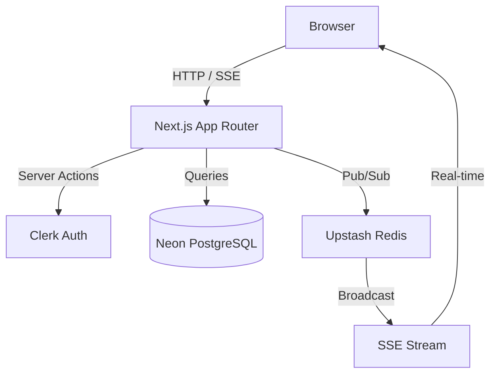

# Architecture

## System Diagram

## Data Flow: Create Issue

1. User submits issue form → `createIssue` Server Action
2. Auth check: `auth()` + `requireWorkspaceMember`
3. Validation: Zod schema parse
4. Transaction:
   a. Generate `sequence_id` via `COALESCE(MAX(sequence_id), 0) + 1`
   b. Insert into `issues`
   c. Record activity in `activity_log`
5. Broadcast: `broadcastIssueUpdate` → Upstash Redis
6. SSE handler forwards to connected clients
7. Client `useIssueStream` updates Tanstack Query cache
8. UI reflects new issue without refetch
